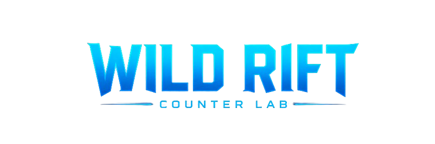
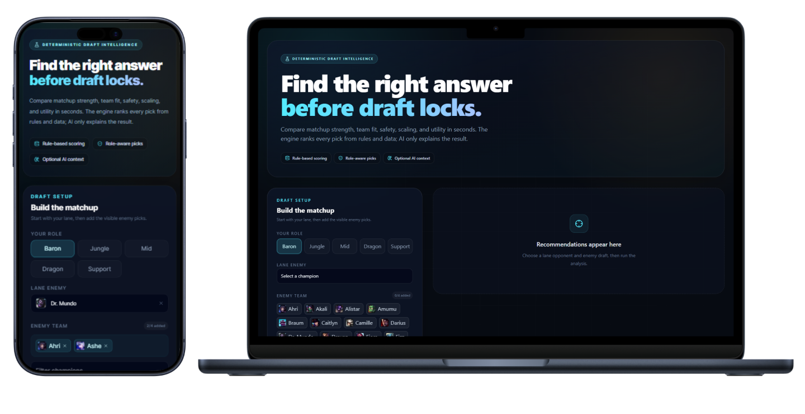
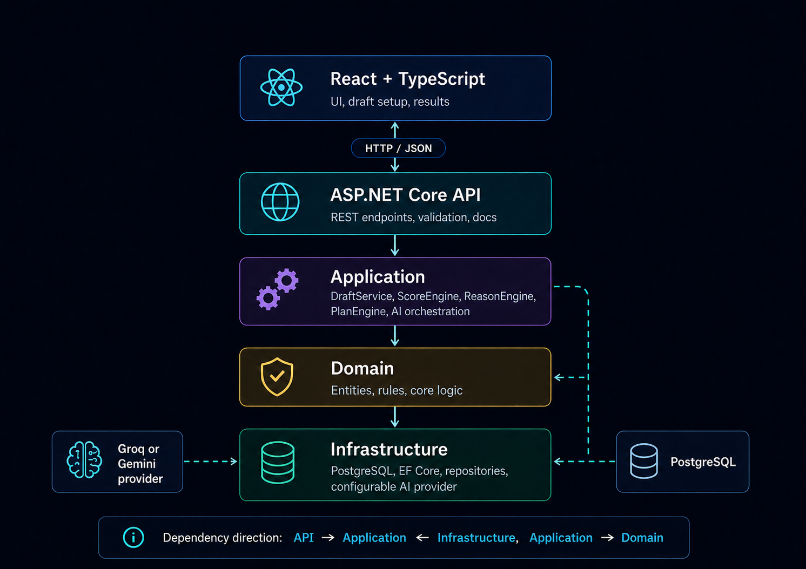

<div align="center">

[![CI][ci-img]][ci-url]
[![Stars][stars-img]][stars-url]
[![Forks][forks-img]][forks-url]

</div>

</br>



<div align="center">

# Wild Rift Counter Lab — **AI Powered Draft Assistant**

Full-stack **champion recommendation platform** for Wild Rift

picks champions based on **role**, **lane matchup**, and **enemy team composition**

and uses **AI only to explain** what the engine already decided.


</div>


## Live Demo [https://wild-riftcounterlab.app](https://wild-rift-app-mocha.vercel.app)




## Quick Highlights

| Area           | Details                                                                         |
| -------------- | ------------------------------------------------------------------------------- |
| Recommendation | Deterministic multi-category scorer — lane, team fit, role, safety, scale, util |
| Architecture   | Clean Architecture (Domain / Application / Infrastructure / API)                |
| AI Role        | Explains ranked results; cannot change scores, reasons, or plans                |
| Champion Data  | Synced from Riot Data Dragon public API — no hard-coded champion list           |
| Data           | PostgreSQL with Entity Framework Core                                           |
| Testing        | xUnit unit tests and ASP.NET Core integration tests                             |
| Delivery       | GitHub Actions CI — build, test, Docker, and production smoke checks            |
| Deployment     | Vercel (frontend) · Railway (API) · Supabase PostgreSQL                         |

## Recommendation Pipeline

1. Validate role and selected enemy champions.
2. Load champions and matchup rules from PostgreSQL.
3. Calculate deterministic score categories.
4. Build rule and tag-based reasons and game plans.
5. Rank and select the top recommendations.
6. Optionally enrich top results with AI explanations — generated after ranking, cached in PostgreSQL.

## Tech Stack

| Area     | Technologies                                                   |
| -------- | -------------------------------------------------------------- |
| Frontend | React, Vite, TypeScript, Tailwind CSS, Framer Motion, axios    |
| Backend  | ASP.NET Core Web API, Clean Architecture, .NET 8               |
| Data     | PostgreSQL, Entity Framework Core                              |
| AI       | GroqCloud chat completions, optional Gemini fallback, PG cache |
| Testing  | xUnit, ASP.NET Core integration testing, EF Core InMemory      |
| Delivery | GitHub Actions CI, Vercel, Render                              |

## Architecture



Application contains the recommendation pipeline and contracts. Infrastructure implements persistence and AI contracts. Domain remains dependency-free.

## Main API Routes

| Method                   | Route                        | Description                                  |
| ------------------------ | ---------------------------- | -------------------------------------------- |
| `GET`                    | `/api/health`                | Health check                                 |
| `GET`                    | `/api/champions`             | List all champions                           |
| `POST`                   | `/api/champions/sync`        | Sync champions from Riot Data Dragon         |
| `POST`                   | `/api/draft/recommendations` | Get ranked counter picks                     |
| `POST`                   | `/api/ai/explain`            | Generate AI explanation for a recommendation |
| `GET\|POST\|PUT\|DELETE` | `/api/champions`             | Champion CRUD                                |
| `GET\|POST\|PUT\|DELETE` | `/api/matchup-rules`         | Matchup rule CRUD                            |

Interactive Scalar API reference is available in Development at `http://localhost:5069/scalar`.

## Local Setup

> [!IMPORTANT]
> - [x] **.NET 8 SDK**
> - [x] **Node.js 20+ with corepack enabled** (`corepack enable`)
> - [x] **PostgreSQL** running locally

**1. Clone the repository**

```bash
git clone https://github.com/hristianivanov/WildRift-CounterLab.git
cd WildRift-CounterLab
```

**2. Set your connection string**

```powershell
dotnet user-secrets set "ConnectionStrings:DefaultConnection" "Host=localhost;Port=5432;Database=wildriftcounterlab;Username=postgres;Password=YOUR_PASSWORD" --project backend/WildRiftCounterLab.Api
```

**3. Run the backend**

```powershell
dotnet run --project backend/WildRiftCounterLab.Api --launch-profile http
```

**4. Install frontend dependencies and start the dev server**

```powershell
cd frontend
corepack pnpm install
corepack pnpm dev
```

<details>
<summary><strong>Optional — AI explanations</strong> <i>(GroqCloud / Gemini)</i></summary>

Set at least one AI provider key to enable the AI explanation step:

```powershell
dotnet user-secrets set "Groq:ApiKey" "your_groq_api_key" --project backend/WildRiftCounterLab.Api
dotnet user-secrets set "Gemini:ApiKey" "your_gemini_api_key" --project backend/WildRiftCounterLab.Api
```

Groq is the primary provider; Gemini is the fallback. Recommendations work without either — the AI explanation step is skipped.

</details>

## Verification

```powershell
# Backend
cd backend
dotnet restore
dotnet build --warnaserror --configuration Release
dotnet test
```

```powershell
# Frontend
cd frontend
corepack pnpm install
corepack pnpm run lint
corepack pnpm run build
```

## Give a Star ⭐

If you find this project useful, please consider giving it a star!

<!---------------------------------- LINKS ------------------------------------->

[stars-img]: https://img.shields.io/github/stars/hristianivanov/WildRift-CounterLab
[stars-url]: https://github.com/hristianivanov/WildRift-CounterLab/stargazers

[forks-img]: https://img.shields.io/github/forks/hristianivanov/WildRift-CounterLab
[forks-url]: https://github.com/hristianivanov/WildRift-CounterLab/network/members

[ci-img]: https://github.com/hristianivanov/WildRift-CounterLab/actions/workflows/ci.yml/badge.svg
[ci-url]: https://github.com/hristianivanov/WildRift-CounterLab/actions/workflows/ci.yml