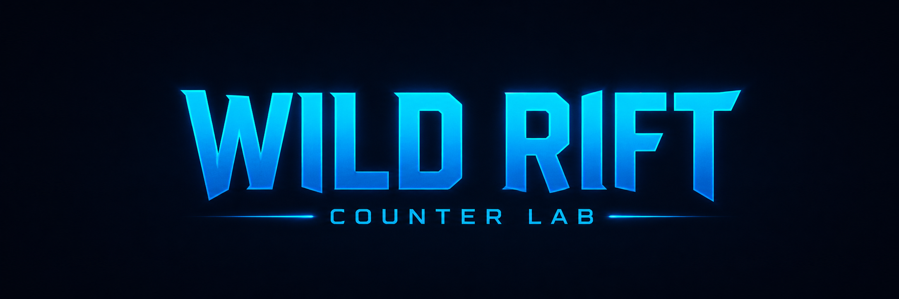
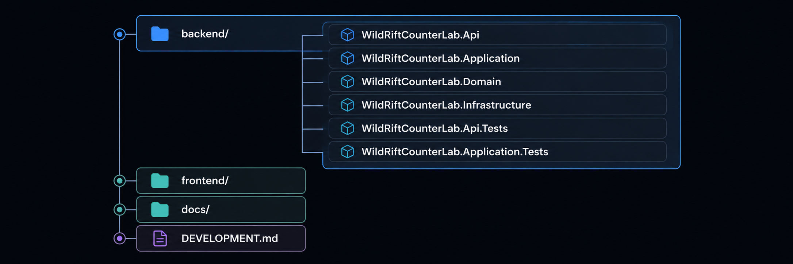
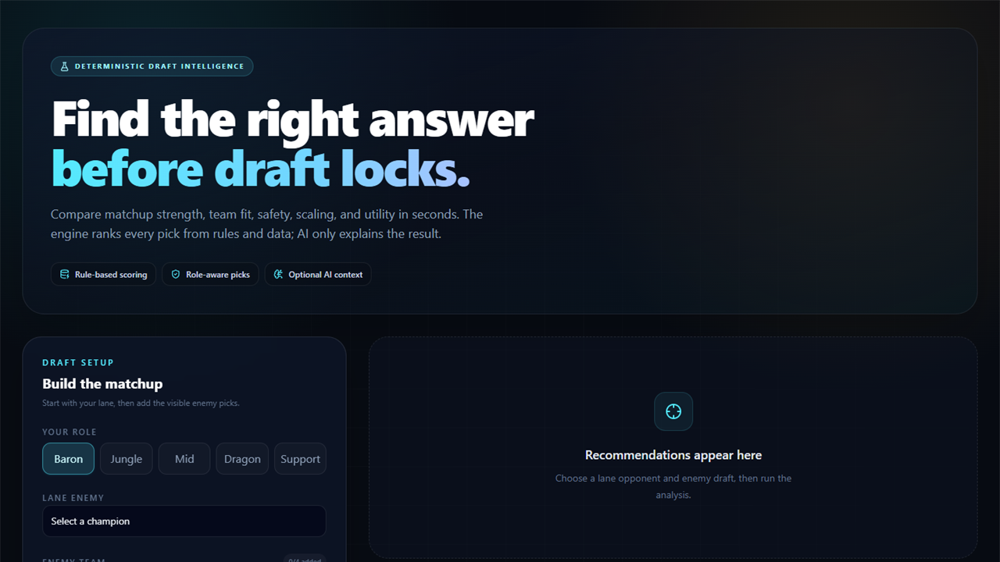
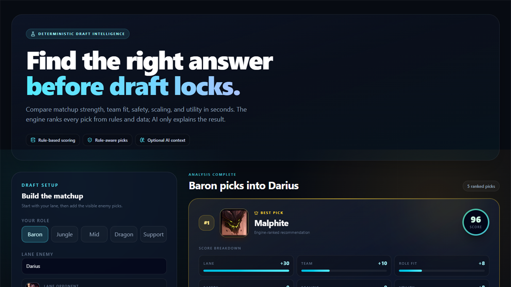
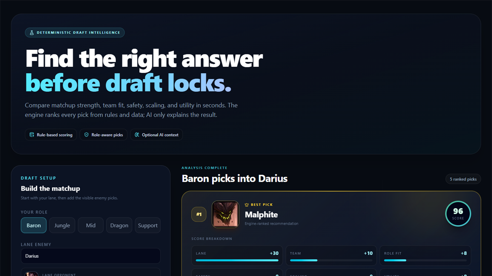
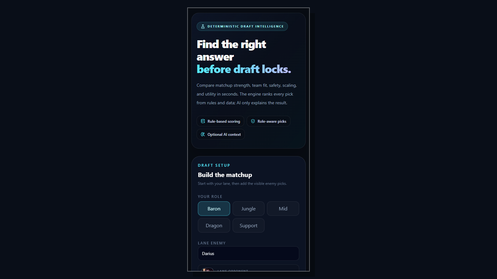

<p align="center">
  
</p>

## Wild Rift Counter Lab - AI Powered Recommendation Platform

Full-stack draft assistant that recommends champion picks from role, lane matchup, and enemy-team composition. It demonstrates deterministic recommendation design, Clean Architecture, full-stack API integration, and responsible use of generative AI.

> **Design principle:** the recommendation engine decides; AI explains.

## Live Demo

- Frontend: [wild-rift-app-mocha.vercel.app](https://wild-rift-app-mocha.vercel.app)
- API health: [wildrift-counterlab-api-production.up.railway.app/api/health](https://wildrift-counterlab-api-production.up.railway.app/api/health)

## Problem Solved

Draft decisions involve more than a single counter matchup. A useful recommendation must also consider role fit, team composition, safety, scaling, and utility. Wild Rift Counter Lab combines those signals into transparent ranked recommendations with reasons and an actionable game plan.

## Key Features

- Deterministic multi-category recommendation scoring
- Score breakdowns for lane, team fit, role fit, safety, scaling, and utility
- Rule-based reasons and game plans
- Optional cached AI explanations generated only after ranking is complete
- Champion and matchup-rule management APIs
- Idempotent initial dataset with 62 champions
- Standardized API errors, Scalar API reference, OpenAPI document, and health endpoint
- Responsive React draft workflow with loading, fallback, error, and empty states

## Architecture


Application contains the recommendation pipeline and contracts. Infrastructure implements persistence and AI contracts. Domain remains dependency-free. See [docs/architecture.md](docs/architecture.md) for details.

## Recommendation Pipeline

1. Validate role and enemy champion selections.
2. Load champions and matching rules from PostgreSQL.
3. Calculate deterministic score categories.
4. Build rule/tag-based reasons and plans.
5. Rank and select the top recommendations.
6. Optionally enrich the top recommendations with asynchronous explanations from the configured AI provider.

Groq and Gemini cannot change scores, ranking, reasons, plans, or score breakdowns.

## Tech Stack

| Area | Technologies |
| --- | --- |
| Frontend | React, Vite, TypeScript, Tailwind CSS, Framer Motion, axios |
| Backend | ASP.NET Core Web API, Clean Architecture |
| Data | PostgreSQL, Entity Framework Core |
| AI | GroqCloud chat completions, optional Gemini fallback, PostgreSQL explanation cache |
| Testing | xUnit, ASP.NET Core integration testing, EF Core InMemory |

## Project Structure



## Screenshots

<table>
  <tr>
    <td align="center" width="50%">
      <strong>Draft setup</strong><br />
      <a href="docs/screenshots/draft-setup.png">
        
      </a>
    </td>
    <td align="center" width="50%">
      <strong>Recommendations</strong><br />
      <a href="docs/screenshots/recommendations.png">
        
      </a>
    </td>
  </tr>
  <tr>
    <td align="center" width="50%">
      <strong>AI analysis</strong><br />
      <a href="docs/screenshots/ai-analysis.png">
        
      </a>
    </td>
    <td align="center" width="50%">
      <strong>Mobile layout</strong><br />
      <a href="docs/screenshots/mobile-layout.png">
        
      </a>
    </td>
  </tr>
</table>

## Local Setup

Detailed PostgreSQL, AI provider secrets, troubleshooting, and demo instructions are in [DEVELOPMENT.md](DEVELOPMENT.md).

```powershell
# Backend
cd backend
dotnet user-secrets set "ConnectionStrings:DefaultConnection" "Host=localhost;Port=5432;Database=wildriftcounterlab;Username=postgres;Password=YOUR_PASSWORD" --project WildRiftCounterLab.Api
dotnet run --project WildRiftCounterLab.Api --launch-profile http

# Frontend
cd frontend
corepack pnpm install
corepack pnpm dev
```

## Deployment Summary

The production target is:

- Vercel for the React frontend
- Railway for the ASP.NET Core API
- Supabase PostgreSQL

The repository includes:

- `frontend/vercel.json`
- `backend/Dockerfile`
- `backend/railway.toml`
- Optional startup migration configuration
- Environment-driven production CORS

See [docs/deployment.md](docs/deployment.md) for the complete environment-variable list, Supabase migration procedure, AI provider verification, health checks, and platform steps.

## Main API Routes

- `GET /api/health`
- `GET /api/champions`
- `POST /api/draft/recommendations`
- `POST /api/ai/explain`
- `GET|POST|PUT|DELETE /api/champions`
- `GET|POST|PUT|DELETE /api/matchup-rules`

See [docs/api.md](docs/api.md) for request and response details.

In Development, the interactive Scalar API reference is available at `http://localhost:5069/scalar`.

## Verification

```powershell
# Backend
cd backend
dotnet restore
dotnet build --warnaserror --configuration Release
dotnet test
```

```powershell
# Frontend
cd frontend
corepack pnpm install
corepack pnpm run lint
corepack pnpm run build
```

The repository includes Application unit tests and API integration tests covering validation, deterministic ranking, AI failure safety, CRUD behavior, seed idempotency, standard errors, and health checks.

## CI/CD

GitHub Actions validates every pull request targeting `main`, every push to `main`, and manual runs:

- Backend restore, warnings-as-errors Release builds, Application/API tests, and API publish validation
- Frontend frozen pnpm install, lint, and production build
- Production Docker image build using the same `backend/Dockerfile` and `backend` context as Railway

Railway and Vercel continue to deploy the backend and frontend from `main` through their existing Git integrations. The workflows do not deploy or require platform tokens. Configure branch protection so the three CI jobs are required before merging:

- `Backend build and tests`
- `Frontend lint and build`
- `Backend Docker build`

The scheduled and manually triggered production smoke workflow checks the deployed backend health endpoint, champions endpoint, and frontend. Configure these public URLs as GitHub repository variables:

- `PRODUCTION_BACKEND_URL`: backend origin without `/api` or a trailing slash, such as `https://YOUR-BACKEND-DOMAIN`
- `PRODUCTION_FRONTEND_URL`: frontend origin without a trailing slash, such as `https://YOUR-FRONTEND-DOMAIN`

## Roadmap

Completed work, near-term improvements, and later ideas are tracked in [docs/roadmap.md](docs/roadmap.md).
