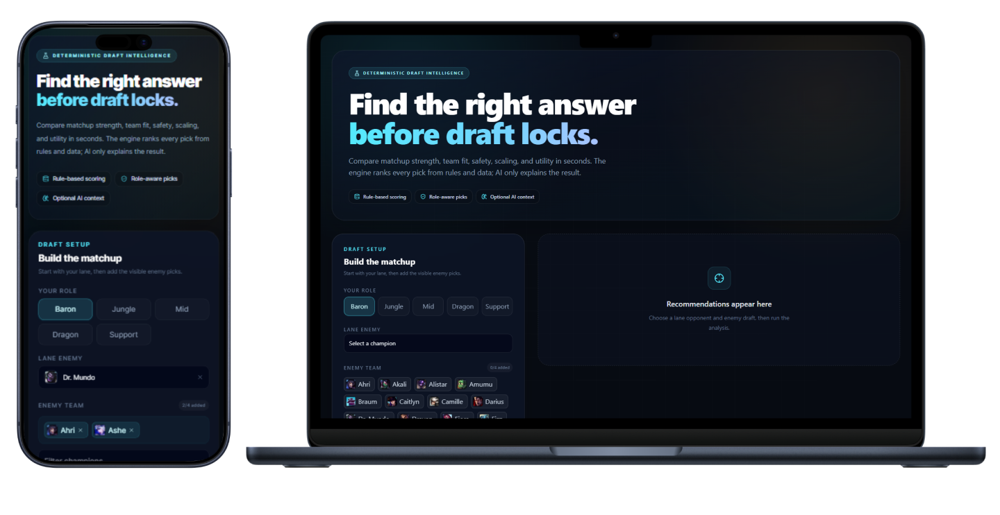
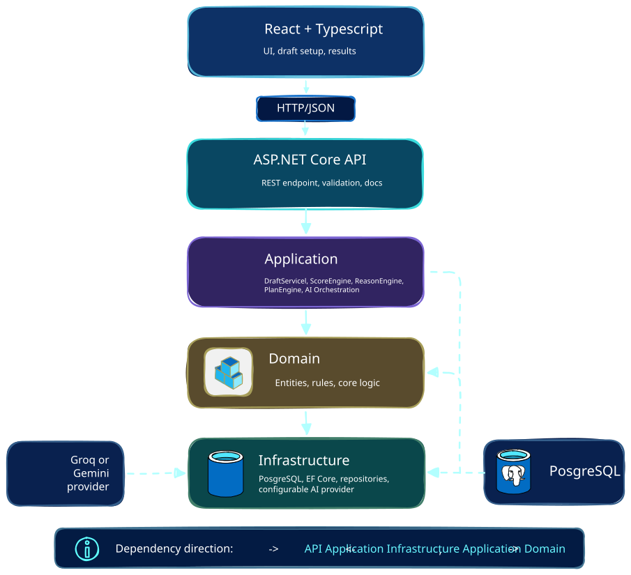

<div align="center">

[![CI][ci-img]][ci-url]
[![Stars][stars-img]][stars-url]
[![Forks][forks-img]][forks-url]

</div>

</br>


<div align="center">

# Wild Rift Counter Lab — **AI Powered Draft Assistant**


Full-stack **champion recommendation platform** for Wild Rift

picks champions based on **role**, **lane matchup**, and **enemy team composition**

and uses **AI only to explain** what the engine already decided.

</div>

</br>

## Live App [https://wild-riftcounterlab.app](https://wildrift-counterlab.vercel.app)




## Quick Highlights

| Area           | Details                                                                         |
| -------------- | ------------------------------------------------------------------------------- |
| Recommendation | Deterministic multi-category scorer — lane, team fit, role, safety, scale, util |
| Architecture   | Clean Architecture (Domain / Application / Infrastructure / API)                |
| AI Role        | Explains ranked results; cannot change scores, reasons, or plans                |
| Champion Data  | Synced from Riot Data Dragon public API — no hard-coded champion list           |
| Data           | PostgreSQL with Entity Framework Core                                           |
| Testing        | xUnit unit tests and ASP.NET Core integration tests                             |
| Delivery       | GitHub Actions CI — build, test, Docker, and production smoke checks            |
| Deployment     | Vercel (client) · Render (API) · Supabase PostgreSQL                            |

</br>

## Tech Stack

| Area     | Technologies                                                                                                                                       |
| -------- | -------------------------------------------------------------------------------------------------------------------------------------------------- |
| Client   | ![React][badge-react] ![Vite][badge-vite] ![TypeScript][badge-ts] ![Tailwind][badge-tailwind] ![Framer Motion][badge-framer] ![Axios][badge-axios] |
| API      | ![ASP.NET Core][badge-aspnet] ![.NET 8][badge-dotnet]                                                                                              |
| Data     | ![PostgreSQL][badge-postgres] ![EF Core][badge-efcore]                                                                                             |
| AI       | ![Groq][badge-groq] ![Gemini][badge-gemini]                                                                                                        |
| Testing  | ![xUnit][badge-xunit]                                                                                                                              |
| Delivery | ![GitHub Actions][badge-gha] ![Vercel][badge-vercel] ![Render][badge-render]                                                                       |

</br>

## Architecture



</br>

## Main API Routes

| Method                                                                          | Route                            | Description                                  |
| ------------------------------------------------------------------------------- | -------------------------------- | -------------------------------------------- |
| ![GET][badge-get]                                                               | **`/api/health`**                | Health check                                 |
| ![GET][badge-get]                                                               | **`/api/champions`**             | List all champions                           |
| ![POST][badge-post]                                                             | **`/api/champions/sync`**        | Sync champions from Riot Data Dragon         |
| ![POST][badge-post]                                                             | **`/api/draft/recommendations`** | Get ranked counter picks                     |
| ![POST][badge-post]                                                             | **`/api/ai/explain`**            | Generate AI explanation for a recommendation |
| ![GET][badge-get] ![POST][badge-post] ![PUT][badge-put] ![DELETE][badge-delete] | **`/api/champions`**             | Champion CRUD                                |
| ![GET][badge-get] ![POST][badge-post] ![PUT][badge-put] ![DELETE][badge-delete] | **`/api/matchup-rules`**         | Matchup rule CRUD                            |

> [!NOTE]
> Interactive __Scalar API__ reference is available in Development at `http://localhost:5069/scalar`.

</br>

## Local Setup

> [!IMPORTANT]
> - [x] **.NET 8 SDK**
> - [x] **Node.js 20+ _with corepack enabled_**
> - [x] **PostgreSQL** *running locally*

**1. Clone the repository**

```bash
git clone https://github.com/hristianivanov/WildRift-CounterLab.git
```

**2. Set your connection string**

```powershell
dotnet user-secrets set "ConnectionStrings:DefaultConnection" "Host=localhost;Port=5432;Database=wildriftcounterlab;Username=postgres;Password=YOUR_PASSWORD" --project api/WildRiftCounterLab.Api
```

**3. Run the backend**

```powershell
dotnet run --project api/WildRiftCounterLab.Api --launch-profile http
```

**4. Install client dependencies and start the dev server**

```powershell
cd client
corepack pnpm install
corepack pnpm dev
```

<details>
<summary><strong>Optional — AI explanations</strong> <i>(GroqCloud / Gemini)</i></summary>

Set at least one AI provider key to enable the AI explanation step:

```powershell
dotnet user-secrets set "Groq:ApiKey" "your_groq_api_key" --project api/WildRiftCounterLab.Api
dotnet user-secrets set "Gemini:ApiKey" "your_gemini_api_key" --project api/WildRiftCounterLab.Api
```

Groq is the primary provider; Gemini is the fallback. Recommendations work without either — the AI explanation step is skipped.

</details>

## Running Tests

```powershell
# API
cd api && dotnet restore && dotnet build --warnaserror --configuration Release && dotnet test
```

```powershell
# Client
cd client && corepack pnpm install && corepack pnpm run lint && corepack pnpm run build
```

## Give a Star ⭐

If you find this project useful, please consider giving it a star!

<!---------------------------------- LINKS ------------------------------------->

[badge-react]:    https://img.shields.io/badge/React-20232A?style=for-the-badge&logo=react&logoColor=61DAFB
[badge-vite]:     https://img.shields.io/badge/Vite-646CFF?style=for-the-badge&logo=vite&logoColor=white
[badge-ts]:       https://img.shields.io/badge/TypeScript-3178C6?style=for-the-badge&logo=typescript&logoColor=white
[badge-tailwind]: https://img.shields.io/badge/Tailwind-06B6D4?style=for-the-badge&logo=tailwindcss&logoColor=white
[badge-framer]:   https://img.shields.io/badge/Framer-FF0050?style=for-the-badge&logo=framer&logoColor=white
[badge-axios]:    https://img.shields.io/badge/Axios-5A29E4?style=for-the-badge&logo=axios&logoColor=white
[badge-aspnet]:   https://img.shields.io/badge/ASP.NET_Core-512BD4?style=for-the-badge&logo=dotnet&logoColor=white
[badge-dotnet]:   https://img.shields.io/badge/.NET_8-512BD4?style=for-the-badge&logo=dotnet&logoColor=white
[badge-postgres]: https://img.shields.io/badge/PostgreSQL-336791?style=for-the-badge&logo=postgresql&logoColor=white
[badge-efcore]:   https://img.shields.io/badge/EF_Core-68217A?style=for-the-badge&logo=dotnet&logoColor=white
[badge-groq]:     https://img.shields.io/badge/Groq-F55036?style=for-the-badge&logo=groq&logoColor=white
[badge-gemini]:   https://img.shields.io/badge/Gemini-4285F4?style=for-the-badge&logo=googlegemini&logoColor=white
[badge-xunit]:    https://img.shields.io/badge/xUnit-7B3F00?style=for-the-badge&logo=dotnet&logoColor=white
[badge-gha]:      https://img.shields.io/badge/GitHub_Actions-2088FF?style=for-the-badge&logo=githubactions&logoColor=white
[badge-vercel]:   https://img.shields.io/badge/Vercel-000000?style=for-the-badge&logo=vercel&logoColor=white
[badge-render]:   https://img.shields.io/badge/Render-46E3B7?style=for-the-badge&logo=render&logoColor=white

[badge-get]:    https://img.shields.io/badge/GET-61affe?style=flat-square
[badge-post]:   https://img.shields.io/badge/POST-49cc90?style=flat-square
[badge-put]:    https://img.shields.io/badge/PUT-fca130?style=flat-square
[badge-delete]: https://img.shields.io/badge/DELETE-f93e3e?style=flat-square

[stars-img]: https://img.shields.io/github/stars/hristianivanov/WildRift-CounterLab
[stars-url]: https://github.com/hristianivanov/WildRift-CounterLab/stargazers

[forks-img]: https://img.shields.io/github/forks/hristianivanov/WildRift-CounterLab
[forks-url]: https://github.com/hristianivanov/WildRift-CounterLab/network/members

[ci-img]: https://github.com/hristianivanov/WildRift-CounterLab/actions/workflows/workflow.yml/badge.svg
[ci-url]: https://github.com/hristianivanov/WildRift-CounterLab/actions/workflows/workflow.yml